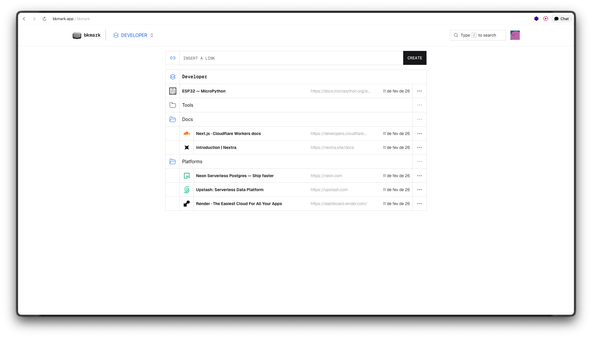

# bkmark - minimal, fast bookmark manager

This is a minimal, fast bookmark manager.  
It lets you quickly save links, organise them into folders and workspaces, and prepares the ground for easy multi‑device sync without requiring a traditional user account system. [Try it out](https://bkmark.app/).

### What this app is

- **Personal bookmark manager**: Save any URL with a single input field.
- **Lightweight accounts**: Instead of a full auth system, the app uses an anonymous identifier to associate bookmarks with a user.
- **Organised collections**: Group bookmarks into **folders** and **workspaces** to keep related links together.
- **Modern UX**: Optimistic updates and a responsive UI so you can keep adding and editing bookmarks without waiting on the network.

### What this app does (how it works)

- **Anonymous user identification**
  - On first access, the app checks for a user identifier in your browser cookies.
  - All bookmarks, folders, and workspaces in the database are keyed by this identifier.

- **Bookmark**
  - You paste a URL into the main input and submit.
  - On the server, the bookmark is stored in a PostgreSQL database via **Drizzle ORM**.

- **Organisation**
  - **Folders**: Use folders to group related links (e.g., “Frontend”, “Articles to read”).
  - **Workspaces**: Higher‑level collections that can hold folders and bookmarks, aimed at sharing and collaboration scenarios.

- **Caching and performance**
  - A Redis instance (Upstash) is used as a cache layer to speed up bookmark listing.
  - The app is built with Next.js App Router, React Server Components, and client components where interactivity is needed.

---

### Tech stack

- **Framework**: Next.js 16 (App Router, React 19)
- **Language**: TypeScript
- **Styling**: Tailwind CSS 4
- **UI**: Radix UI primitives, Lucide/Hugeicons icon sets
- **Data layer**:
  - PostgreSQL with **Drizzle ORM** and drizzle-kit migrations
  - Neon serverless Postgres (via `@neondatabase/serverless`)
  - Upstash Redis (via `@upstash/redis`) for caching
- **State & data fetching**: React context/hooks and TanStack Query where appropriate

### Project structure (high level)

- **`src/app/(app)`**: Main application routes (home, folders, workspaces, sync, modals).
- **`src/components/bookmarks`**: Bookmark UI components (forms, lists, actions like move/rename/delete).
- **`src/infra/db`**: Drizzle schema, migrations, and repositories for Postgres.
- **`src/server/actions` & `src/server/data`**: Server actions and data access helpers for bookmarks and related entities.
- **`src/contexts` & `src/hooks`**: React context and hooks (e.g. bookmarks context and `useBookmarks` hook).
- **`src/lib`**: Shared utilities (e.g. Redis client, ID generation helpers).

### Roadmap / TODO

Some ideas that are already tracked:

- **Add sortable/draggable UI**: Allow users to sort bookmarks and folders.
- **Shared folders and workspaces**: Allow sharing collections with other users.
- **Add items into shared collections**: Let collaborators add folders and bookmarks to shared spaces.
